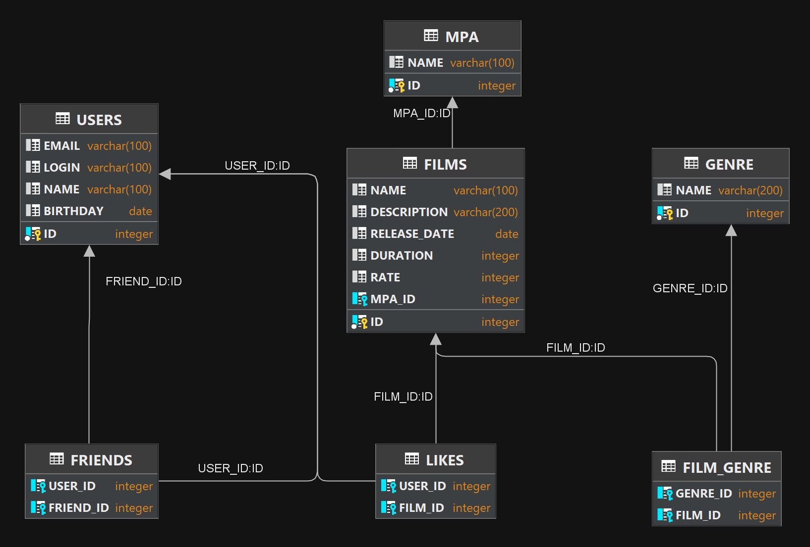

## java-filmorate:
Backend service that works with movies and user ratings. 

### Functional:
You can add, delete, update films and users,
add or delete friends, also you can like films and get most popular films by likes.

### DB schema:

### Technology stack:
<a href="https://spring.io/">
  &nbsp;
</a>
<a href="https://maven.apache.org/">
  &nbsp;
</a>
<a href="https://www.baeldung.com/spring-jdbc-jdbctemplate">
  &nbsp;
</a>
<a href="https://www.h2database.com/html/main.html">
  &nbsp;
</a>
<a href="https://projectlombok.org/">
  &nbsp;
</a>
<a href="https://site.mockito.org/">
  &nbsp;
</a>

### System requirements:
JDK 11 amazon corretto  
IntellijIdea

### Startup instructions:
Download zip  
Unpack zip  
Open app in IntellijIdea  
Start app from main class  
Test app with postman tests collection in postman package  
